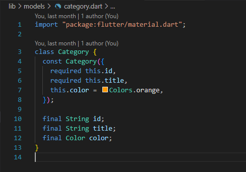
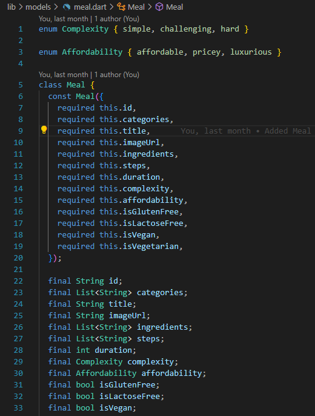
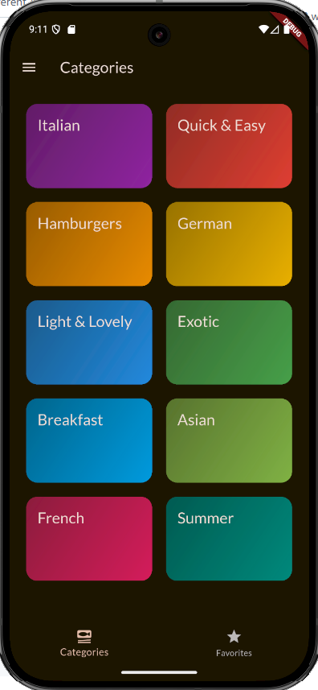
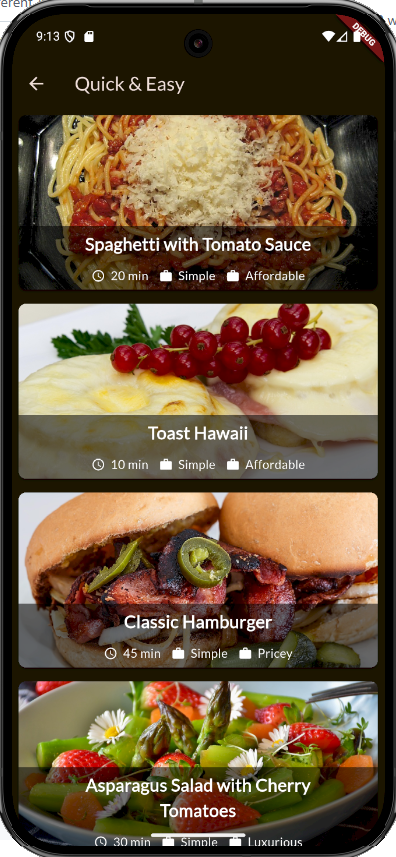
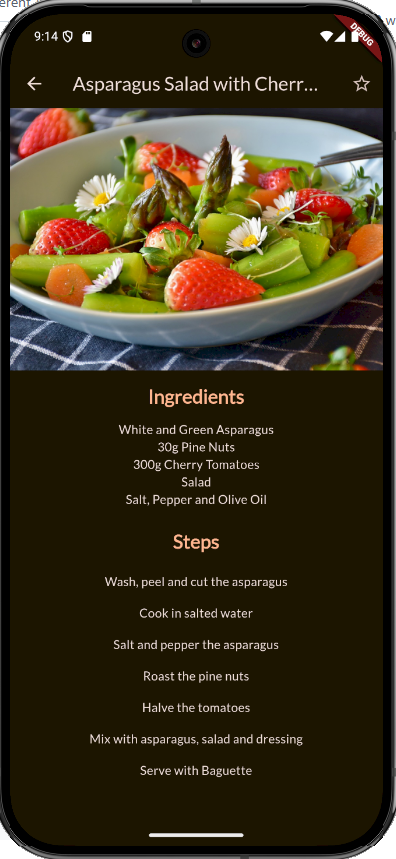
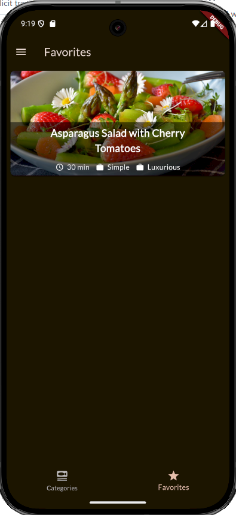
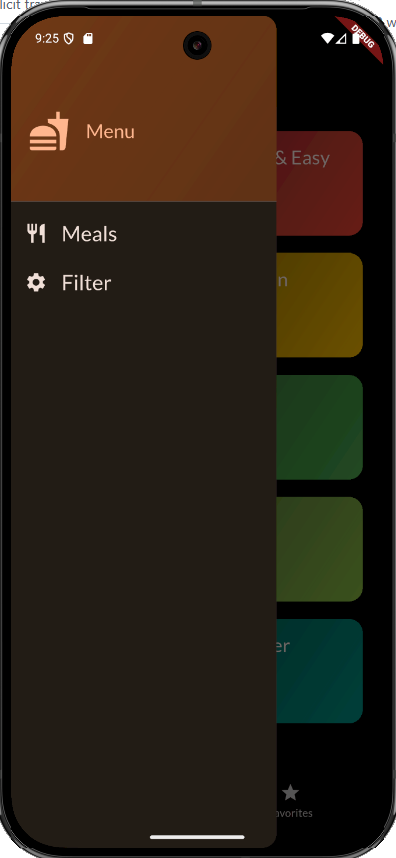
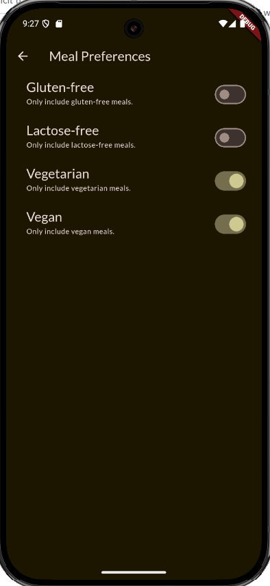

# Flutter Meals

## Description

This is my third application developed in **Flutter** and **Dart** in my journey to become proficient in cross-platform application development using modern platforms.

This is a mobile application for managing meals that deeps dive more on advanced concepts like interactivity with additional widgets for managing data grids, tabs, and screen navigation. The application allows sharing state accross multiple screens.

## User Stories

```
As a mindful software developer
I want to track my meal details by categories
So that I can plan and achieve my long-term health goals
```

```
As an application user
I want to be able to track different types of meals
So that I can choose according to my preferences and mood
```

```
As an application user
I want to be able to select and save favorite meals
So that I can quickly access my preferred ones
```

```
As an application user
I want to be able to filter meals according to my dietary preferences
So that I can make healthy decisions
```

## Design

```
--\lib\models\category.dart:

Contains an object consisting of the predefined attributes that comprise a category record; for simplicity, that is an id, title, and color for grid display purposes.
```



```
--\lib\models\meal.dart:

Contains an object consisting of the predefined attributes that comprise a meal record; this is a more complex model consisting of an id, categories, title, image, ingredients, cooking steps, duration, complexity (a list of predefined values [simple, challenging, hard]), and affordability (a list of predefined values [affordable, pricey, luxurios]), as well as health attributes used for selection like gluten-free, lactose-free, vegetarian, and vegan.
```



```
--\lib\screens\categories.dart:

Main screen. Manages the application flow, including switching between tabs and screens:
```

### Main Screen



### Meals Screen



### Meals Details Screen



### Favorite Meals Screen



### Main Drawerr



### Meal Preferences Filter Screen



## License

This project is licensed under The MIT License. Refer to https://opensource.org/licenses/MIT for more information of what you can and cannot do with this project. See contact information below if you have questions, comments, or suggestions for the project.

## Contributing Guidelines

Want to contribute to this project? You may clone or fork the project in GitHub. Note the licesing information referred in this file.

## License

This application is licensed under the following license:

[](https://opensource.org/licenses/MIT)(https://opensource.org/licenses/MIT)
